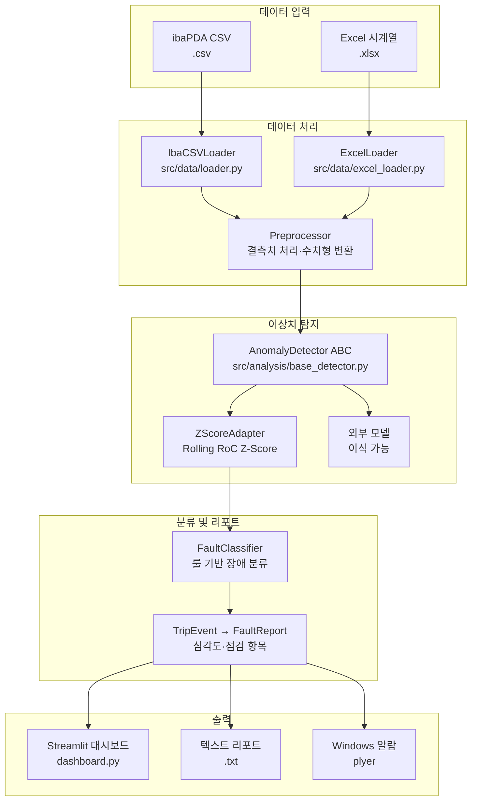
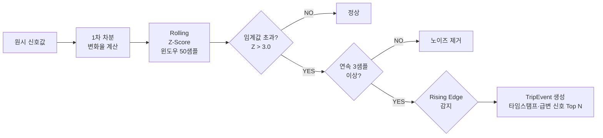
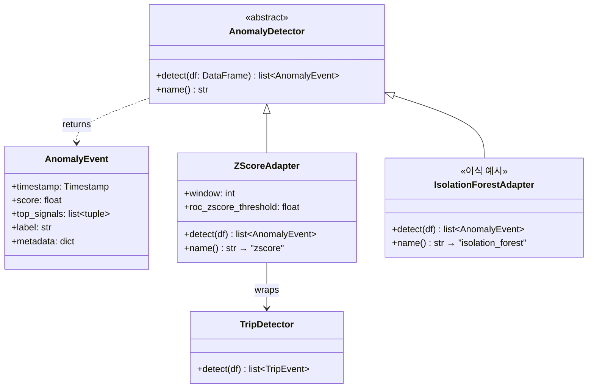
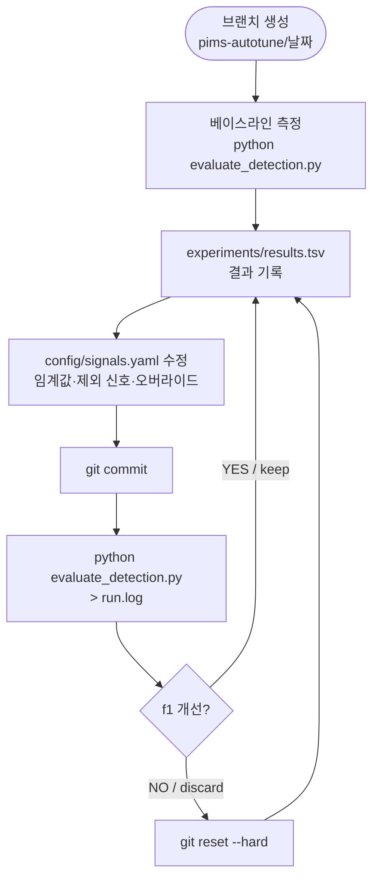
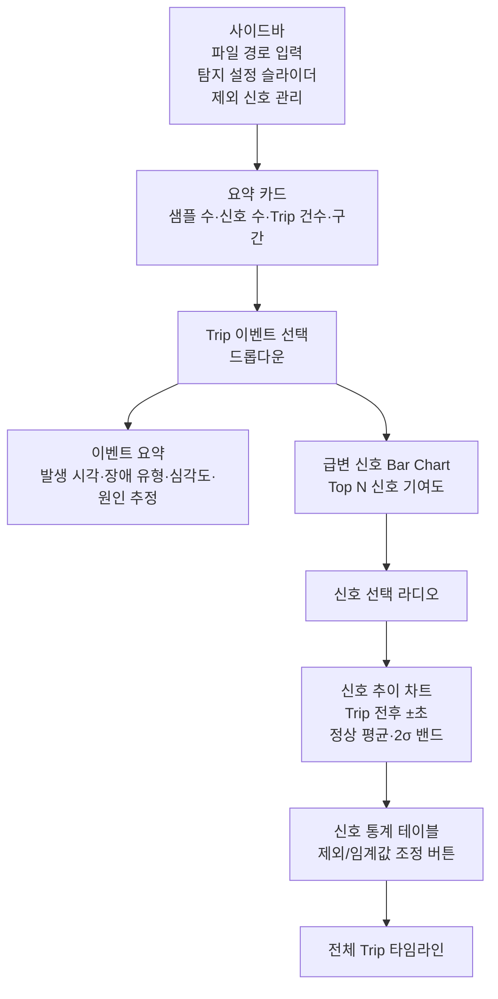

# PIMS — Plant Information Management System

ibaPDA Analyzer CSV 데이터를 실시간으로 분석해 설비 이상을 탐지하고,  
Streamlit 대시보드로 시각화하는 설비 이상 탐지 시스템.

---

## 시스템 구조



---

## 이상치 탐지 알고리즘



**핵심 설계:** 신호 역할(속도/전류 등)을 몰라도 동작.  
아날로그 신호(unique값 > 10)를 자동 선별 후 변화율 기반 탐지.

---

## 플러거블 모델 아키텍처



외부 모델 이식 시 `AnomalyDetector`를 상속해 `detect()`와 `name()`만 구현하면  
대시보드·평가 함수를 수정하지 않고 모델을 교체할 수 있다.  
→ [reference/how-to-plug-model.md](reference/how-to-plug-model.md)

---

## AutoResearch 자가개선 루프



autoresearch 방식 적용: **단 하나의 파일**(`signals.yaml`)만 수정하고,  
**고정 평가 함수**(`evaluate_detection.py`)로 성능을 측정한다.

| autoresearch | PIMS |
|---|---|
| `train.py` | `config/signals.yaml` |
| `prepare.py::evaluate_bpb` | `evaluate_detection.py::evaluate()` |
| `val_bpb` | F1 스코어 |
| `results.tsv` | `experiments/results.tsv` |

---

## 대시보드 화면 구성



---

## 디렉토리 구조

```
PIMS/
├── dashboard.py              # Streamlit 대시보드 (메인 UI)
├── main.py                   # CLI 진입점 (단일 파일 / 폴더 감시)
├── evaluate_detection.py     # AutoResearch 고정 평가 함수 ⚠️ 수정 금지
│
├── src/
│   ├── data/
│   │   ├── loader.py         # ibaPDA CSV 로더 (비표준 포맷)
│   │   └── excel_loader.py   # Excel 시계열 로더
│   └── analysis/
│       ├── base_detector.py  # AnomalyDetector ABC + AnomalyEvent
│       ├── zscore_adapter.py # ZScoreAdapter (기본 모델)
│       ├── trip_detector.py  # Rolling RoC Z-Score 탐지기
│       ├── fault_classifier.py # 룰 기반 장애 분류기
│       └── preprocessor.py   # 결측치 처리·수치형 변환
│
├── config/
│   ├── signals.yaml          # 신호 그룹·임계값 (AutoResearch 수정 대상)
│   └── settings.yaml         # 경로·LLM·분석 파라미터
│
├── experiments/
│   ├── eval_data/            # 평가용 CSV 고정 세트 (git 미추적)
│   └── results.tsv           # 실험 이력 (git 미추적)
│
├── reference/
│   ├── pims_program.md       # AutoResearch 에이전트 지시서
│   ├── how-to-plug-model.md  # 외부 모델 이식 가이드
│   └── apply_guide.md        # autoresearch → PIMS 적용 가이드
│
└── tests/                    # pytest (47개)
```

---

## 빠른 시작

### 대시보드 실행

```bash
streamlit run dashboard.py
```

사이드바에서 ibaPDA CSV 또는 Excel 파일 경로를 입력하고 **분석 실행** 클릭.

### CLI 단일 파일 분석

```bash
python main.py --file "C:/ibaData/2603201549_oven.csv"
```

### CLI 폴더 감시 데몬

```bash
python main.py   # config/settings.yaml의 watch_folder 감시
```

### AutoResearch 루프 시작

```bash
# 1. 평가 CSV를 experiments/eval_data/ 에 복사
# 2. evaluate_detection.py의 KNOWN_EVENTS에 이상 발생 시각 기록
# 3. 베이스라인 측정
python evaluate_detection.py

# 4. 실험 시작 (reference/pims_program.md 참조)
git checkout -b pims-autotune/$(date +%Y%m%d)
```

---

## 설정

### `config/settings.yaml`

```yaml
watch_folder: "C:/ibaData/exports"
output_folder: "C:/ibaData/reports"
llm:
  enabled: false
  model: "qwen3:4b"
  host: "http://localhost:11434"
analysis:
  trip_window: 50                   # Rolling 윈도우 (샘플 수)
  trip_roc_zscore_threshold: 3.0    # 변화율 Z-Score 임계값
  top_n_signals: 5                  # 급변 신호 표시 개수
detector:
  name: "zscore"                    # 탐지 모델 식별자
```

### `config/signals.yaml` (AutoResearch 수정 대상)

```yaml
signal_groups:
  drive_db420:
    zscore_threshold: 3.0   # 조정 가능
excluded_signals: []         # 노이즈 신호 제외 목록
signal_overrides: {}         # 신호별 개별 임계값
```

---

## 외부 모델 교체

`AnomalyDetector` ABC를 상속해 `detect()`와 `name()`만 구현하면 된다.

```python
from src.analysis.base_detector import AnomalyDetector, AnomalyEvent
import pandas as pd

class IsolationForestAdapter(AnomalyDetector):
    def detect(self, df: pd.DataFrame) -> list[AnomalyEvent]:
        ...

    def name(self) -> str:
        return "isolation_forest"
```

이후 `dashboard.py`와 `evaluate_detection.py`의 `build_detector()` 함수만 교체.  
→ 상세: [reference/how-to-plug-model.md](reference/how-to-plug-model.md)

---

## 테스트

```bash
pytest tests/ -v --ignore=tests/test_watcher.py
```

| 테스트 파일 | 대상 |
|---|---|
| `test_loader.py` | ibaPDA CSV 파싱 |
| `test_excel_loader.py` | Excel 로더 |
| `test_preprocessor.py` | 결측치 처리 |
| `test_trip_detector.py` | Trip 탐지 알고리즘 |
| `test_base_detector.py` | AnomalyDetector ABC |
| `test_zscore_adapter.py` | ZScoreAdapter |
| `test_evaluate_detection.py` | 고정 평가 함수 |
| `test_fault_classifier.py` | 룰 기반 분류기 |
